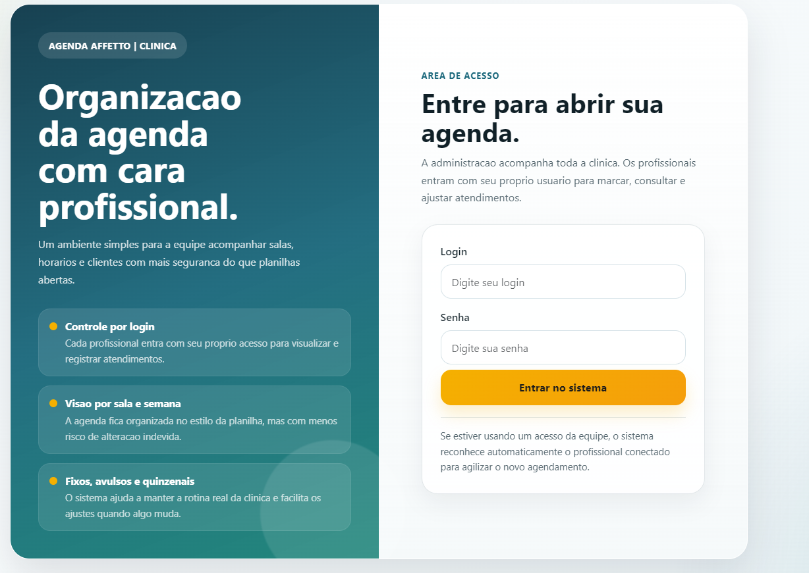
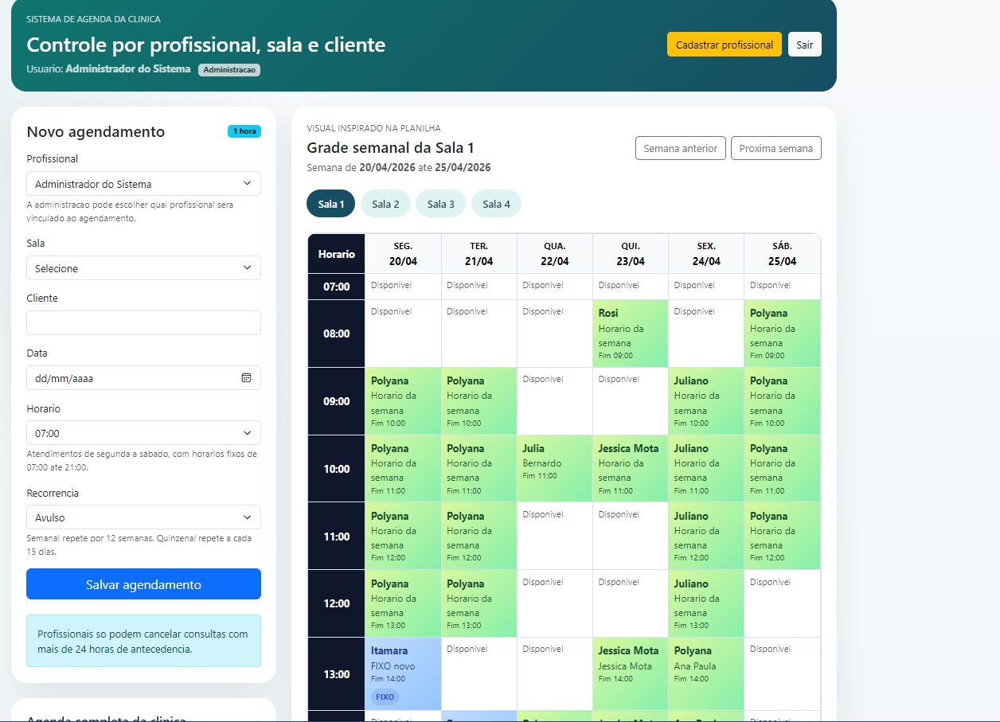
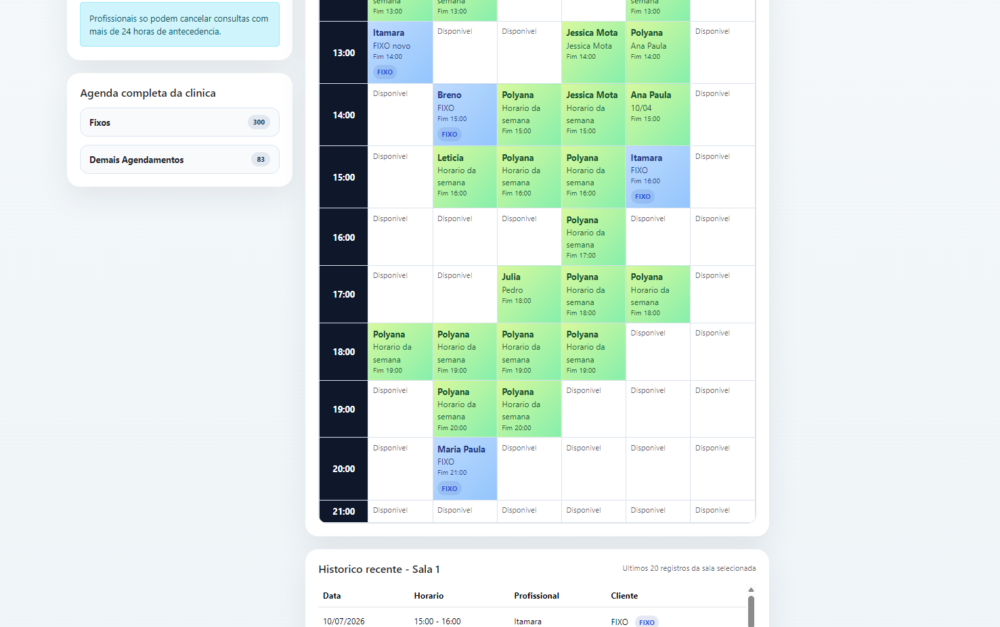

# Agenda Affetto

Sistema web de agenda para clinica com controle por profissional, sala e cliente.

Este projeto foi desenvolvido como item de portfólio para substituir o uso de planilhas abertas por um fluxo mais seguro, organizado e visual para a rotina da clinica.

## O que o sistema faz

- login por usuario
- separacao entre administracao e profissionais
- agendamento por sala, data, horario e cliente
- grade semanal inspirada na planilha da clinica
- suporte a atendimentos avulsos, fixos e quinzenais
- bloqueio de cancelamento com menos de 24 horas para profissionais
- cadastro de novos profissionais pela administracao

## Tecnologias

- Java 17
- Spring Boot
- Spring MVC
- Spring Data JPA
- Thymeleaf
- H2
- PostgreSQL
- Bootstrap 5
- Maven

## Demo hospedada

- App online: [https://clinica-agenda-production.up.railway.app](https://clinica-agenda-production.up.railway.app)
- Repositorio: [https://github.com/Widineii/clinica-agenda](https://github.com/Widineii/clinica-agenda)

## Screenshots

### Tela de login



### Dashboard e grade semanal



### Detalhe da agenda da clinica



## Rodando localmente

Requisitos:

- Java 17+
- Maven Wrapper do projeto

Comandos:

```powershell
./mvnw.cmd spring-boot:run
```

Acesso local:

- Login: [http://localhost:8081/login](http://localhost:8081/login)
- Dashboard: [http://localhost:8081/agendamentos/dashboard](http://localhost:8081/agendamentos/dashboard)

## Acesso de demonstracao

As credenciais da demonstracao nao ficam expostas neste repositorio publico.

Se voce quiser apresentar a versao online em entrevista, curriculo ou portfolio,
o acesso pode ser disponibilizado separadamente.

## Estrutura do projeto

```text
src/main/java/com/clinica/sistema
  controller/
  service/
  repository/
  model/
  config/

src/main/resources
  templates/
  application-local.properties
  application-prod.properties
```

## Diferenciais para portfólio

- projeto baseado em caso real de uso
- migracao de planilha para sistema web
- interface ajustada para exibicao de grade semanal
- regras de negocio da clinica implementadas no backend
- versao online preparada para apresentacao

## Observacao

Esta versao hospedada foi configurada como demonstracao de portfólio, com base de dados de demo para facilitar apresentacao e testes.
